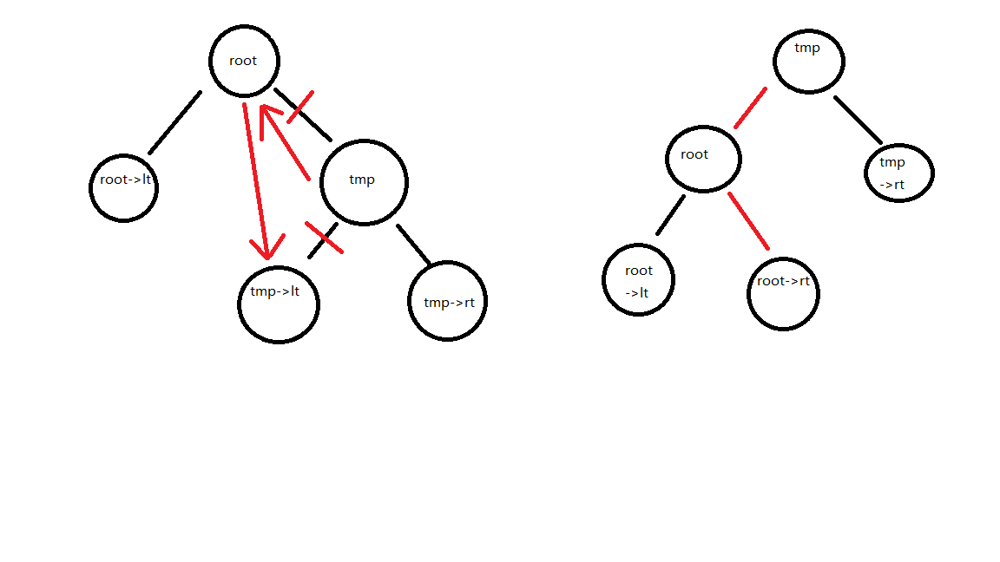
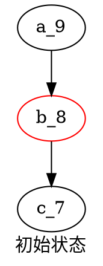
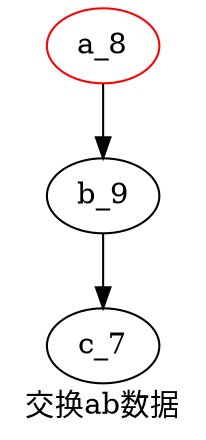
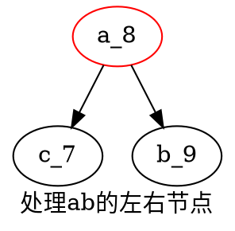
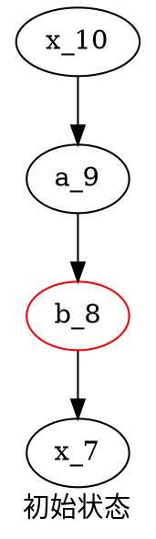
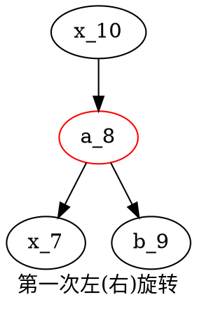
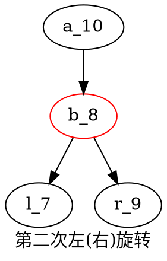
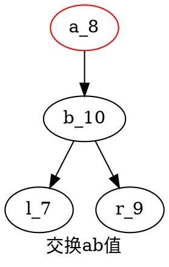
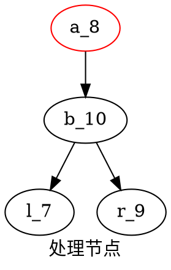
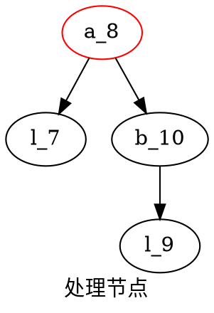

avlTree 自平衡二叉查找树 是在插入的时候进行旋转,使树的深度相同(不超过1)


splayTree 伸展树 是在搜索的时候将节点往上提,提到根节点

单次左(右)旋

```graphviz
digraph{
    label="初始状态"
    b_8[color=red]
    a_9->b_8->c_7;
}
```

```graphviz
digraph{
    label="交换ab数据"
    a_8[color=red]
    a_8->b_9->c_7
}
```

```graphviz
digraph{
    label="处理ab的左右节点"
    a_8[color=red]
    a_8->c_7
    a_8->b_9
}
```

多次左(右)旋转

第一次旋转

```graphviz
digraph{
    label="初始状态"
    b_8[color=red]
    x_10->a_9->b_8->x_7
}
```


```graphviz
digraph{
    label="第一次左(右)旋转"
    a_8[color=red]
    a_8->x_7
    x_10->a_8->b_9
}
```
第二次左(右)旋转

```graphviz
digraph{
    label="第二次左(右)旋转"
    b_8[color=red]
    b_8->l_7
    a_10->b_8->r_9
}
```

```graphviz
digraph{
    label="交换ab值"
    a_8[color=red]
    b_10->l_7
    a_8->b_10->r_9
}
```
```cpp
a->lt=b->lt;
b->lt=b->rt
b->rt=NULL
```

```graphviz
digraph{
    label="处理节点"
    a_8[color=red]
    b_10->l_7
    a_8->b_10->r_9
}
```

```graphviz
digraph{
    label="处理节点"
    a_8[color=red]
    a_8->l_7
    a_8->b_10->l_9
}
```
